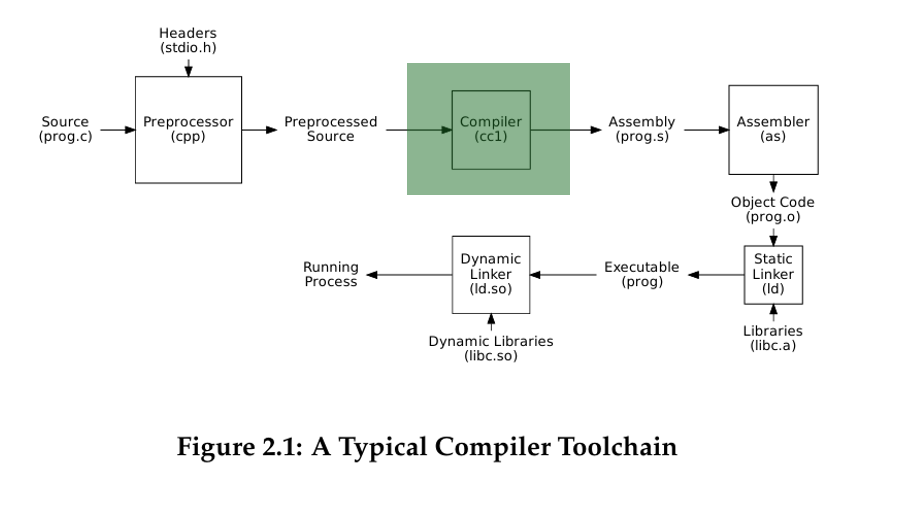
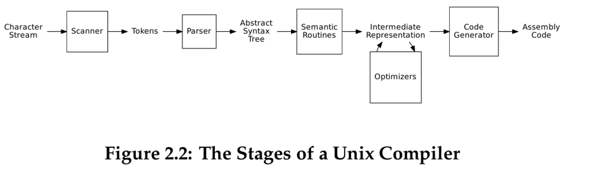

# 🛠️ Custom Built-In `gj_compiler`

## 📘 Introduction

A **compiler toolchain** is a sequence of tools that transforms high-level source code into a runnable program. Each tool in the chain performs a specific role in the compilation process:



This project implements a **custom compiler in C++**, designed to simulate this toolchain by integrating **lexical analysis**, **parsing**, and **semantic processing** using `Flex` and `Bison`.


## 🔍 Compiler Architecture: Stages of a Unix Compiler

Modern compilers, including those found in Unix systems, follow a structured sequence of stages to translate source code into low-level assembly. Each stage performs a specific transformation, moving closer from raw code to executable instructions.

The diagram below illustrates the core pipeline of a Unix-style compiler:



### 🚧 Overview of Stages

We will take inspiration from this model to structure the `gj_compiler` implementation. The key stages are:

---

### 1. **Scanner (Lexical Analysis)**

📌 **Input:** Character stream

📌 **Output:** Tokens

The scanner (also known as the lexer) breaks the raw source code into **tokens**—the smallest units of meaning such as keywords, identifiers, numbers, and symbols. This step filters out whitespace and comments and provides a clean stream of tokens to the parser.

📦 **Tool:** Implemented using **Flex**

---

### 2. **Parser (Syntax Analysis)**

📌 **Input:** Tokens

📌 **Output:** Abstract Syntax Tree (AST)

The parser organizes the tokens according to the language grammar, producing an **Abstract Syntax Tree** (AST). This tree reflects the hierarchical structure of the program (e.g., nested expressions and statements).

📦 **Tool:** Implemented using **Bison**

---

### 3. **Semantic Routines (Semantic Analysis)**

📌 **Input:** AST

📌 **Output:** Enriched AST or Symbol Table

This phase ensures the program is **semantically valid**. For example, it checks that variables are declared before use, function calls match their definitions, and types are used consistently.

We will also perform symbol resolution and type checking here.

---

### 4. **Intermediate Representation (IR)**

📌 **Input:** Enriched AST

📌 **Output:** Intermediate Code (Platform-neutral)

The IR is a low-level, abstract representation of the program used as a stepping stone toward machine code. It is easier to optimize and transform than high-level source code.

Our compiler may implement a simplified form of IR for educational purposes.

---

### 5. **Optimizers**

📌 **Input/Output:** Intermediate Representation

This optional stage **refines the IR** to improve performance. For example, it may eliminate dead code, simplify expressions, or optimize loops.

In `gj_compiler`, basic optimization techniques may be introduced later in development.

---

### 6. **Code Generator**

📌 **Input:** (Optimized) IR

📌 **Output:** Assembly Code

The code generator translates the IR into **assembly language**, suitable for the target architecture. This is the final step before feeding the code into an assembler (e.g., `as`) to produce object files.


## ✅ Prerequisites

Before launching the program, ensure the following tools are installed:

* **Flex**: Lexical analyzer generator
* **Bison**: Parser generator (GNU Project)
* **jq**: Lightweight and flexible command-line JSON processor
* **Graphviz**: Used to visualize abstract syntax trees (ASTs) with `dot`

### 🔧 Install in Ubuntu or WSL

```bash
sudo apt update && sudo apt install -y bison flex jq graphviz
```

## 💻 Development Environment

This project is organized into several key components:

| Directory/File   | Description                                      |
| ---------------- | ------------------------------------------------ |
| `Makefile`       | Build automation script                          |
| `src`, `include` | C++ source files and headers                     |
| `Assets`         | Grammar files: `parser.bison` and `scanner.flex` |
| `Build`          | Directory where build artifacts are stored       |
| `bminor_tests`   | Test cases for different stages of compilation   |
| `Scripts`        | Includes `setup_and_build.sh` and `run_tests.sh` |
| `doc`            | Contains supporting documentation                |

## 🚀 Usage

### Compile the Project

```bash
./setup_and_build.sh
```

This compiles the entire project and generates the executable `gj_compiler`.

### Run Test Cases

```bash
./run_tests.sh
```

This runs the automated test suite using predefined examples in the `bminor_tests` directory.

## 📚 Resources

* 📘 [Compiler Examples Repository](https://github.com/dthain/compilerbook-examples/tree/master): Sample implementations from the Compiler Construction book.
* 🧠 [Compiler Book](http://compilerbook.org/): A modern introduction to compiler design.
* 🧪 [Compiler Explorer](https://godbolt.org/): Live online compiler for exploring assembly output.

## 👨‍💻 Author

```
Ghassen Jamoussi
```